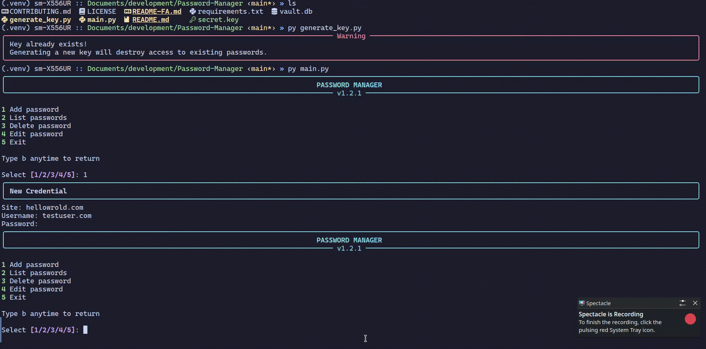

# Password Manager

<p align="center">


</p>

A secure and lightweight **CLI password manager** built with Python.

Passwords are encrypted using **Fernet symmetric encryption (AES-256)** and stored locally in a **SQLite database**. No cloud, no tracking, and no external services.

## Demo



## Features

* AES-256 encryption via Fernet
* Local SQLite database storage
* Beautiful interactive terminal UI powered by [Rich](https://github.com/Textualize/rich)
* Automatic encryption key generation
* Password masking during input
* Input validation
* Graceful `Ctrl+C` handling
* Atomic database transactions with automatic rollback
* Fully offline — your data stays on your machine


## Technologies

| Technology   | Purpose                   |
| ------------ | ------------------------- |
| Python 3.14+ | Main programming language |
| SQLite3      | Local embedded database   |
| cryptography | Fernet encryption         |
| Rich         | Terminal interface        |


## Project Structure

```text
.
├── main.py           # Application entry point
├── generate_key.py   # Encryption key generator
├── secret.key        # Encryption key (keep safe!)
├── vault.db          # Password database
├── requirements.txt  # Python dependencies
├── README.md         # English documentation
├── README-FA.md      # Persian documentation
└── LICENSE
```


## Installation

### Clone repository

```bash
git clone https://github.com/SMHO179/Password-Manager.git
cd Password-Manager
```

### Create virtual environment

```bash
python -m venv .venv
source .venv/bin/activate
```

### Install dependencies

```bash
pip install -r requirements.txt
```


## Usage

Run the application:

```bash
python main.py
```

## Security

* Passwords are **never stored as plaintext**
* Every vault uses its own unique encryption key
* The encryption key is required to decrypt stored passwords
* Password input is hidden while typing
* Invalid empty inputs are rejected

> Losing `secret.key` means your encrypted passwords cannot be recovered.

Keep your key file safe and backed up.


## Database Schema

| Column     | Type      | Description               |
| ---------- | --------- | ------------------------- |
| id         | INTEGER   | Primary key               |
| site       | TEXT      | Website or service name   |
| username   | TEXT      | Account username          |
| password   | TEXT      | Fernet encrypted password |
| created_at | TIMESTAMP | Creation time             |


## Contributing

Contributions are welcome!

1. Fork the repository
2. Create your feature branch
3. Commit your changes
4. Open a Pull Request


## License

This project is licensed under the terms of the [LICENSE](LICENSE).
