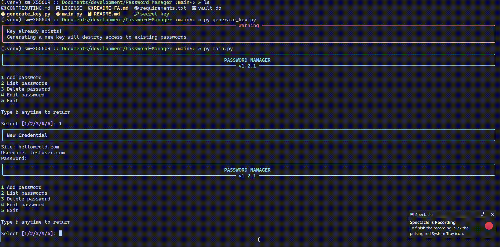

# Password Manager

A CLI and GUI password manager for securely storing and managing credentials with end-to-end encryption.

## Demo



## Features

- **Encrypted storage** — Passwords are encrypted with Fernet before being persisted to a local SQLite database.
- **Password generation** — Produces cryptographically secure random passwords of configurable length.
- **Strength checker** — Rates password strength (Weak, Medium, Strong, Very Strong) in real time.
- **Clipboard support** — Copies generated passwords to the system clipboard.
- **Dual interface** — Terminal CLI with a `rich` UI, plus a native PyQt6 GUI.
- **Full CRUD** — Add, list, edit, and delete credentials from the vault.

## Requirements

- Python 3.10+
- SQLite3 (bundled with Python)

## Installation

Clone the repository and install dependencies:

```bash
git clone https://github.com/SMohammad-Molanezhad/password-manager.git
cd password-manager
python -m venv .venv
source .venv/bin/activate
pip install -r requirements.txt
```

For the GUI version, also install `PyQt6`:

```bash
pip install -r requirements-gui.txt
```

## Usage

Start the CLI:

```bash
python main.py
```

The encryption key is created automatically on first run. To regenerate the key, use:

```bash
python generate_key.py
```

The interactive menu lets you:

1. Add a new credential
2. List all stored credentials
3. Delete a credential by ID
4. Edit an existing credential
5. Generate a secure password
6. Exit

### GUI

```bash
python main_gui.py
```

## Project Structure

```
Password-Manager/
├── app/
│   ├── cli/              # Terminal UI (menus, prompts, panels)
│   ├── crypto/           # Fernet encryption & key management
│   ├── database/         # SQLite connection, queries, repository
│   ├── gui/              # PyQt6 GUI window and widgets
│   ├── services/         # Business logic (password gen & service)
│   └── utils/            # Clipboard, helpers, strength checker
├── main.py               # CLI entry point
├── main_gui.py           # GUI entry point
├── generate_key.py       # Standalone key generator
├── vault.db              # Encrypted credential store
├── secret.key            # Encryption key (not tracked in git)
└── requirements.txt      # Core dependencies
```

## Configuration

Settings are defined in `app/config.py`:

| Constant   | Purpose                        |
|------------|--------------------------------|
| `VERSION`  | Application version           |
| `DB_NAME`  | SQLite database file path     |
| `KEY_FILE` | Encryption key file path      |
| `STYLE`    | Rich terminal colour theme    |

Edit this file to adjust defaults.

## Security Notes

- The encryption key (`secret.key`) is stored in the working directory. **Back it up securely** — losing it makes stored passwords irrecoverable.
- Add `secret.key` and `vault.db` to `.gitignore` before sharing the repository.
- Key file permissions are set to `0600` on Unix automatically.

## License

[MIT](LICENSE)